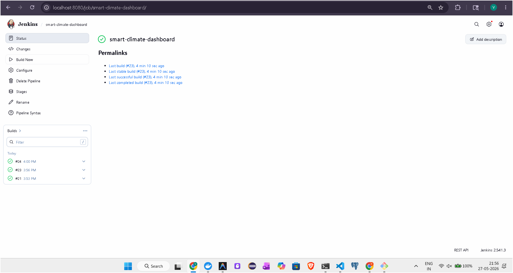
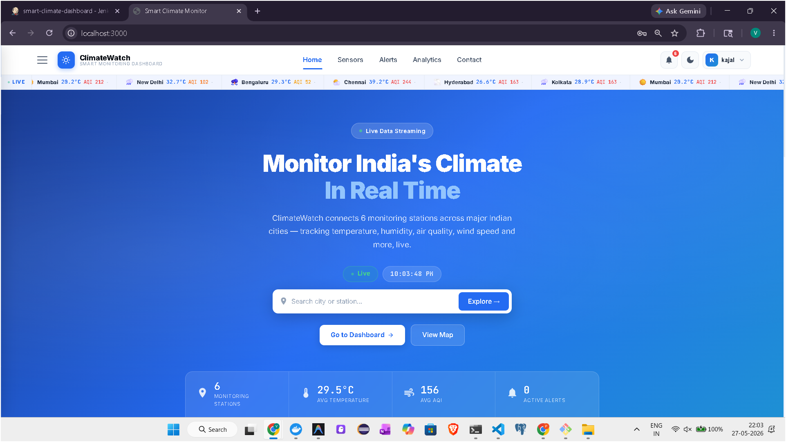
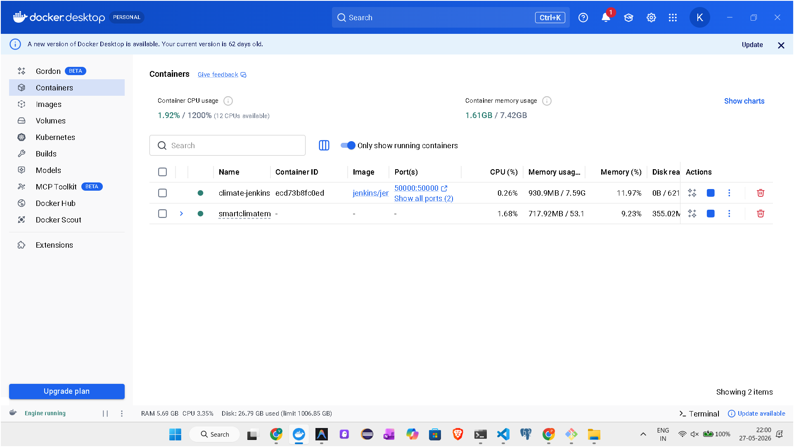
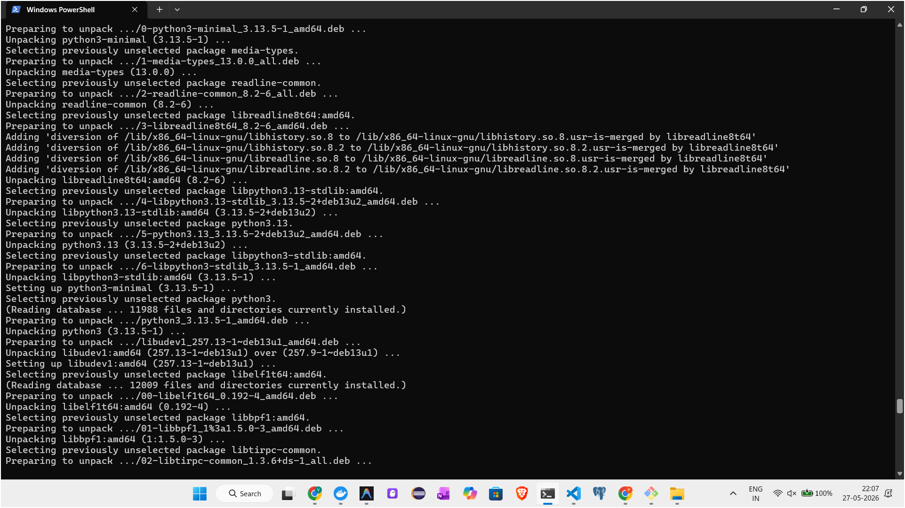
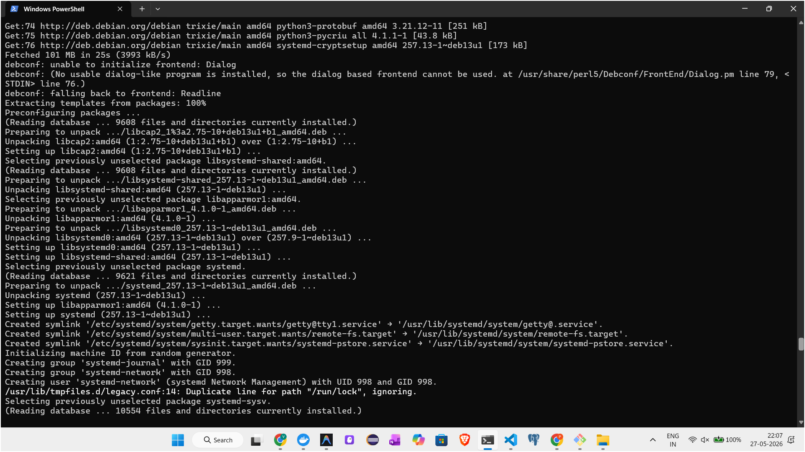
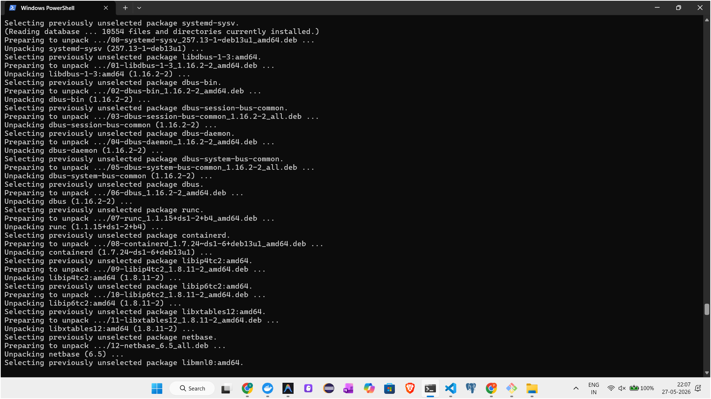
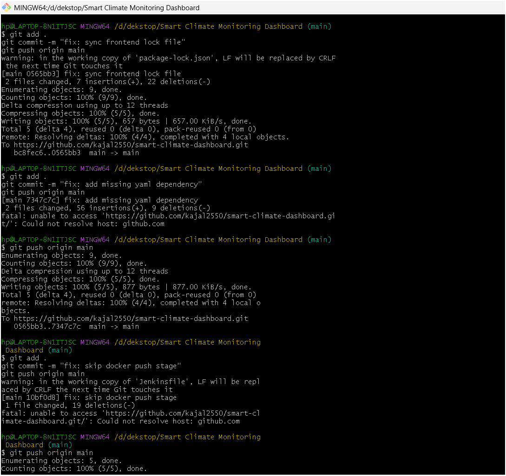
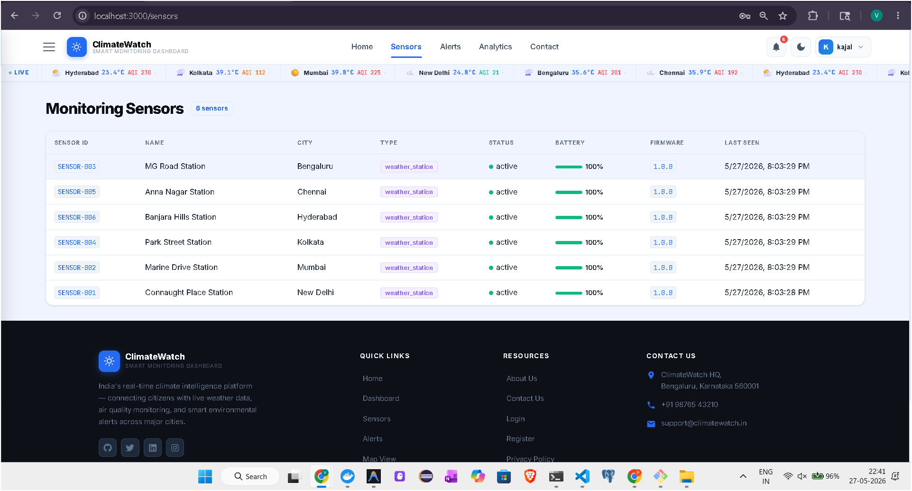
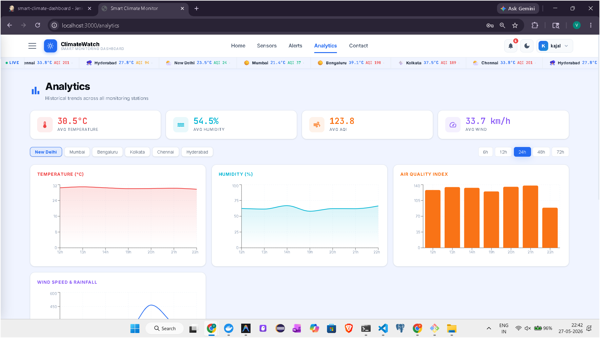

<div align="center">


<h1 align="center">
  
  &nbsp;Smart Climate Monitoring Dashboard&nbsp;
  
</h1>

<p align="center">
  <i>⚡ Full-Stack Real-Time Climate Monitoring · Containerized · CI/CD Automated ⚡</i>
</p>

</div>

<div align="center">

<table>
<tr>
<td align="center">

<div style="display:inline-block; border: 2.5px solid #2ecc40; border-radius: 10px; padding: 10px 24px; background: linear-gradient(135deg, #0d1f0d 0%, #0a2a0a 100%); box-shadow: 0 0 16px #2ecc4088;">

🟢 &nbsp; **Live Demo** &nbsp; | &nbsp; <a href="#" style="color:#2ecc40; font-weight:bold; font-size:16px; text-decoration:none; letter-spacing:0.5px;">🌐 Click Here to Visit Website</a> &nbsp; 🟢

</div>

</td>
</tr>
</table>

</div>

<div style="display:flex; flex-wrap:wrap; gap:8px; margin-bottom:24px;">
  <a href="https://www.docker.com/" target="_blank"></a>
  <a href="https://www.jenkins.io/" target="_blank"></a>
  <a href="https://nodejs.org/" target="_blank"></a>
  <a href="https://reactjs.org/" target="_blank"></a>
  <a href="https://www.mongodb.com/" target="_blank"></a>
  <a href="https://www.nginx.com/" target="_blank"></a>
  <a href="https://github.com/aquasecurity/trivy" target="_blank"></a>
  <a href="https://www.docker.com/products/docker-compose" target="_blank"></a>
</div>

**DevOps Project** — Full‑stack real‑time climate monitoring application containerized with Docker and automated with a Jenkins CI/CD pipeline.

---

## 📌 Table of Contents

- [Project Overview](#1-project-overview)
- [DevOps Focus Areas](#2-devops-focus-areas)
- [Architecture](#3-architecture)
- [MERN Stack Breakdown](#4-mern-stack-breakdown)
- [Docker — Containerization](#5-docker--containerization)
- [Jenkins — CI/CD Pipeline](#6-jenkins--cicd-pipeline)
- [Project Structure](#7-project-structure)
- [Application Features](#8-application-features)
- [API Endpoints](#9-api-endpoints)
- [Socket.IO Real-Time Events](#10-socketio-real-time-events)
- [Quick Start](#11-quick-start)
- [Running Tests](#12-running-tests)
- [Production Deployment](#13-production-deployment)
- [Security](#14-security)
### Jenkins Pipeline Success


### Dashboard UI


### Docker Containers


### CI/CD Terminal Output




### Terminal Image


### Sensor Image


### Analytics Image



---

## 1. Project Overview

This is a **DevOps-focused project** that demonstrates how to build, containerize, and automate the deployment of a full-stack web application using industry-standard DevOps tools and practices.

The application itself is a real-time climate monitoring dashboard that tracks temperature, humidity, air quality index (AQI), wind speed, UV index, and rainfall from 8 major Indian cities using simulated IoT sensor data.

**The core DevOps deliverables are:**
- ✅ Containerized every component with **Docker**
- ✅ Orchestrated multi-container setup with **Docker Compose**
- ✅ Automated build → test → scan → push → deploy with **Jenkins**
- ✅ Multi-stage Docker builds for optimized image sizes
- ✅ Container health checks and dependency ordering
- ✅ Environment-based configuration (dev / staging / production)
- ✅ Docker image vulnerability scanning with **Trivy**
- ✅ Reverse proxy with **Nginx**

---

## 2. DevOps Focus Areas

This project covers the following DevOps pillars:

| DevOps Pillar | Tool / Practice Used |
|--------------|---------------------|
| **Containerization** | Docker — each service in its own container |
| **Container Orchestration** | Docker Compose — multi-container lifecycle management |
| **CI/CD Automation** | Jenkins Declarative Pipeline (Jenkinsfile) |
| **Source Control Integration** | Jenkins polls/webhooks Git repository |
| **Automated Testing** | Jest unit tests + integration tests in pipeline |
| **Security Scanning** | Trivy — scans Docker images for CVE vulnerabilities |
| **Image Registry** | Docker Hub — stores and versions built images |
| **Reverse Proxy** | Nginx — routes traffic, serves static files |
| **Environment Config** | `.env` files, Docker build args, envsubst |
| **Health Monitoring** | Docker HEALTHCHECK on every container |
| **Multi-Environment** | Separate compose files for dev / staging / production |
| **Infrastructure as Code** | All infrastructure defined in YAML/Dockerfile/Jenkinsfile |

---

## 3. Architecture

### System Architecture

```
┌─────────────────────────────────────────────────────────────────┐
│                    DOCKER HOST MACHINE                          │
│                                                                 │
│  ┌─────────────────────────────────────────────────────────┐   │
│  │              Docker Network: climate-net                 │   │
│  │                                                         │   │
│  │  ┌─────────────────┐      ┌──────────────────────────┐ │   │
│  │  │ climate-frontend │      │    climate-backend        │ │   │
│  │  │                 │      │                          │ │   │
│  │  │  Nginx (Alpine) │─────▶│  Node.js + Express       │ │   │
│  │  │  React SPA      │      │  Socket.IO Server        │ │   │
│  │  │  Port: 80       │      │  Data Simulator          │ │   │
│  │  │  Host: 3000     │      │  Port: 5000              │ │   │
│  │  └─────────────────┘      └────────────┬─────────────┘ │   │
│  │                                        │               │   │
│  │                           ┌────────────▼─────────────┐ │   │
│  │                           │     climate-mongo         │ │   │
│  │                           │                          │ │   │
│  │                           │  MongoDB 7.0             │ │   │
│  │                           │  Port: 27017             │ │   │
│  │                           └──────────────────────────┘ │   │
│  └─────────────────────────────────────────────────────────┘   │
└─────────────────────────────────────────────────────────────────┘
```

### Request Flow

```
Browser Request
      │
      ▼
Nginx (Port 3000)
      │
      ├── /api/*        ──▶  Node.js Backend (Port 5000)
      │                              │
      ├── /socket.io/*  ──▶  Socket.IO Server          ──▶  MongoDB
      │
      └── /*            ──▶  React Static Files (index.html)
```

> Nginx acts as a **reverse proxy** — the browser never communicates with the backend directly. All traffic goes through Nginx.

### CI/CD Flow

```
Developer pushes code to Git
            │
            ▼
    Jenkins detects push
    (webhook or SCM polling)
            │
            ▼
┌───────────────────────────┐
│     JENKINS PIPELINE      │
│                           │
│  1. Checkout              │
│  2. Lint (parallel)       │
│  3. Unit Tests (parallel) │
│  4. Build Docker Images   │
│  5. Security Scan (Trivy) │
│  6. Integration Tests     │
│  7. Push to Docker Hub    │
│  8. Deploy (SSH)          │
│  9. Smoke Test            │
└───────────────────────────┘
            │
            ▼
  Application Updated Live
```

---

## 4. MERN Stack Breakdown

| Letter | Technology | Role in This Project |
|--------|-----------|---------------------|
| **M** | MongoDB 7.0 | Stores sensor readings, alerts, sensor metadata. Runs in `climate-mongo` container. Seeded with 8 Indian city sensors on first startup via `mongo-init/init.js` |
| **E** | Express.js | REST API framework. Handles all `/api/*` routes. Includes middleware for CORS, rate limiting, input validation, error handling |
| **R** | React 18 | Single Page Application (SPA). All UI — dashboard, charts, alerts, map, analytics. Built to static files by Nginx in production |
| **N** | Node.js | JavaScript runtime that executes the Express server. Also runs the data simulator that generates fake IoT sensor readings every 5 seconds |

---

## 5. Docker — Containerization

### Why Docker?

Docker solves the **"works on my machine"** problem. Every developer and every server runs the exact same environment — same OS, same Node version, same MongoDB version — because everything is defined in code (Dockerfile).

### Containers in This Project

| Container | Base Image | Purpose |
|-----------|-----------|---------|
| `climate-mongo` | `mongo:7.0-jammy` | MongoDB database |
| `climate-backend` | `node:20-alpine` (multi-stage) | Node.js API + Socket.IO |
| `climate-frontend` | `node:20-alpine` → `nginx:1.25-alpine` (multi-stage) | React app served by Nginx |
| `climate-mongo-express` | `mongo-express:1.0.2` | DB admin UI (debug profile only) |

### Multi-Stage Docker Builds

Multi-stage builds produce **smaller, more secure production images** by separating the build environment from the runtime environment.

**Backend Dockerfile:**
```dockerfile
# Stage 1 — Install dependencies and prepare
FROM node:20-alpine AS builder
WORKDIR /app
COPY package*.json ./
RUN npm ci --only=production

# Stage 2 — Production runtime (no dev tools, no npm cache)
FROM node:20-alpine AS production
WORKDIR /app
COPY --from=builder /app/node_modules ./node_modules
COPY . .
USER node                    # Non-root for security
CMD ["node", "server.js"]
```

**Frontend Dockerfile:**
```dockerfile
# Stage 1 — Build React app
FROM node:20-alpine AS builder
WORKDIR /app
COPY package*.json ./
RUN npm install
COPY . .
RUN npm run build            # Outputs to /app/build

# Stage 2 — Serve with Nginx (no Node.js in final image)
FROM nginx:1.25-alpine AS production
COPY --from=builder /app/build /usr/share/nginx/html
COPY nginx.conf /etc/nginx/templates/default.conf.template
ENV BACKEND_HOST=backend
ENV BACKEND_PORT=5000
USER nginx
```

**Result:** Frontend image is ~25MB instead of ~500MB (no Node.js in production).

### Docker Compose Files

| File | Purpose | Ports |
|------|---------|-------|
| `docker-compose.yml` | Development / local stack | 3000, 5000, 27017 |
| `docker-compose.v2.yml` | Second instance (parallel) | 3001, 5001, 27018 |
| `docker-compose.prod.yml` | Production (uses registry images) | 80, 443 |

### Container Health Checks

Every container has a health check so Docker knows when it's truly ready:

```yaml
# MongoDB health check
healthcheck:
  test: ["CMD", "mongosh", "--eval", "db.adminCommand('ping')"]
  interval: 30s
  timeout: 10s
  retries: 5
  start_period: 30s

# Backend health check
healthcheck:
  test: ["CMD", "wget", "-qO-", "http://localhost:5000/health"]
  interval: 30s
  timeout: 10s
  retries: 5

# Frontend health check
healthcheck:
  test: ["CMD", "wget", "-qO-", "http://localhost:80/"]
  interval: 30s
  timeout: 10s
  retries: 3
```

**Dependency ordering with health checks:**
```yaml
backend:
  depends_on:
    mongo:
      condition: service_healthy   # Backend waits for MongoDB to be ready

frontend:
  depends_on:
    backend:
      condition: service_healthy   # Frontend waits for backend to be ready
```

### Docker Networking

All containers communicate over a **custom bridge network** (`climate-net`) using container names as hostnames — no hardcoded IP addresses:

```
backend connects to MongoDB:  mongodb://mongo:27017/climate_db
nginx proxies to backend:     http://backend:5000/api/
```

### Environment Variable Substitution (envsubst)

The Nginx config uses `${BACKEND_HOST}` and `${BACKEND_PORT}` placeholders. At container startup, `envsubst` replaces them with actual values from environment variables — making the same Docker image work for both port 3000 and port 3001 stacks:

```nginx
location /api/ {
    proxy_pass http://${BACKEND_HOST}:${BACKEND_PORT}/api/;
}
```

```yaml
# docker-compose.yml (original stack)
environment:
  BACKEND_HOST: backend
  BACKEND_PORT: 5000

# docker-compose.v2.yml (second stack)
environment:
  BACKEND_HOST: backend-v2
  BACKEND_PORT: 5001
```

---

## 6. Jenkins — CI/CD Pipeline

### What is CI/CD?

| Term | Meaning | In This Project |
|------|---------|----------------|
| **CI** (Continuous Integration) | Automatically build and test every code push | Jenkins runs lint + tests + Docker build on every push |
| **CD** (Continuous Deployment) | Automatically deploy after successful CI | Jenkins SSHs into server and runs `docker compose up -d` |

### Jenkinsfile — All 9 Stages Explained

The entire pipeline is defined as code in `Jenkinsfile` at the project root.

```groovy
pipeline {
    agent any
    environment {
        DOCKER_HUB_CREDENTIALS = credentials('docker-hub-credentials')
        IMAGE_BACKEND  = "${DOCKER_HUB_USERNAME}/climate-backend"
        IMAGE_FRONTEND = "${DOCKER_HUB_USERNAME}/climate-frontend"
        IMAGE_TAG      = "${BUILD_NUMBER}-${GIT_COMMIT.take(7)}"
    }
```

#### Stage 1 — Checkout
```
Action:  git checkout (pull latest code from repository)
Purpose: Get the source code that triggered the build
Output:  Working directory with latest code + commit message logged
```

#### Stage 2 — Lint & Static Analysis (Parallel)
```
Action:  npm run lint on backend + eslint on frontend (runs simultaneously)
Purpose: Catch syntax errors and code style issues before building
Output:  Lint warnings/errors logged (non-blocking with || true)
```

#### Stage 3 — Unit Tests (Parallel)
```
Action:  npm test --coverage on backend + frontend (runs simultaneously)
Purpose: Verify business logic works correctly
Output:  JUnit XML test reports + HTML coverage reports published in Jenkins
Tools:   Jest (backend), React Testing Library (frontend)
```

#### Stage 4 — Build Docker Images (Parallel)
```
Action:  docker build for backend + frontend (runs simultaneously)
Purpose: Create production Docker images
Options: --cache-from pulls previous image to speed up build
         --target production uses only the production stage
Tags:    IMAGE:BUILD_NUMBER-COMMIT_HASH  +  IMAGE:latest
```

#### Stage 5 — Security Scan (Trivy)
```
Action:  trivy image scan on both built images
Purpose: Find known CVE vulnerabilities in the Docker images
Scope:   HIGH and CRITICAL severity only
Output:  trivy-backend.txt + trivy-frontend.txt archived as build artifacts
Note:    --exit-code 0 means pipeline continues even if vulnerabilities found
         (change to 1 to fail the build on critical CVEs)
```

#### Stage 6 — Integration Tests
```
Action:  docker compose up mongo + backend → health check → docker compose down
Purpose: Test that the real containers work together end-to-end
Steps:   1. Start MongoDB + Backend containers
         2. Wait 15 seconds for startup
         3. Hit /health endpoint inside the container
         4. Tear down test environment (always, even on failure)
```

#### Stage 7 — Push to Registry
```
Action:  docker login → docker push both images to Docker Hub
Purpose: Store versioned images in a central registry for deployment
When:    Only on main / master / develop branches (not feature branches)
Tags:    Pushes both :BUILD_NUMBER-COMMIT and :latest tags
```

#### Stage 8 — Deploy
```
Staging (develop branch):
  Action:  SSH into staging server → docker compose pull → docker compose up -d
  Purpose: Auto-deploy every develop push to staging environment

Production (main/master branch):
  Action:  Manual approval gate → SSH → docker compose pull → up -d
  Purpose: Human must click "Deploy" in Jenkins before production update
  Safety:  input() step pauses pipeline and waits for admin approval
```

#### Stage 9 — Smoke Test
```
Action:  curl http://DEPLOY_HOST/health
Purpose: Verify the deployed application is actually responding
When:    After every successful deployment
```

### Pipeline Visualization

```
Push to Git
    │
    ▼
┌──────────┐    ┌──────────────────────────────────────────┐
│ Checkout │───▶│ Lint Backend  │  Lint Frontend            │ (parallel)
└──────────┘    └──────────────────────────────────────────┘
                    │
                    ▼
                ┌──────────────────────────────────────────┐
                │ Test Backend  │  Test Frontend            │ (parallel)
                └──────────────────────────────────────────┘
                    │
                    ▼
                ┌──────────────────────────────────────────┐
                │ Build Backend │  Build Frontend           │ (parallel)
                └──────────────────────────────────────────┘
                    │
                    ▼
                ┌──────────────┐
                │ Trivy Scan   │
                └──────────────┘
                    │
                    ▼
                ┌──────────────┐
                │ Integration  │
                │    Tests     │
                └──────────────┘
                    │
              (main/develop only)
                    │
                    ▼
                ┌──────────────┐
                │ Push to      │
                │ Docker Hub   │
                └──────────────┘
                    │
          ┌─────────┴──────────┐
          │                    │
    (develop)              (main/master)
          │                    │
          ▼                    ▼
    ┌──────────┐        ┌──────────────┐
    │ Deploy   │        │ Manual Gate  │
    │ Staging  │        │ (input step) │
    └──────────┘        └──────┬───────┘
          │                    │
          │                    ▼
          │             ┌──────────────┐
          │             │ Deploy Prod  │
          │             └──────────────┘
          │                    │
          └─────────┬──────────┘
                    │
                    ▼
              ┌──────────┐
              │  Smoke   │
              │   Test   │
              └──────────┘
```

### Branch Strategy

| Branch | What Jenkins Does |
|--------|------------------|
| `feature/*` | Checkout → Lint → Test → Build → Scan |
| `develop` | + Push to Docker Hub + Auto-deploy to Staging + Smoke Test |
| `main` / `master` | + Push to Docker Hub + **Manual approval** + Deploy to Production + Smoke Test |

### Jenkins Credentials to Configure

Go to **Jenkins → Manage Jenkins → Credentials → Global → Add Credential**

| Credential ID | Type | Value |
|--------------|------|-------|
| `docker-hub-credentials` | Username with password | Docker Hub username + password/token |
| `deploy-server-ssh` | SSH Username with private key | SSH private key for deployment server |
| `deploy-server-host` | Secret text | IP address or hostname of deployment server |
| `sonar-token` | Secret text | SonarQube token (optional) |

### Jenkins Setup Steps

```
1. Install Jenkins (or use Docker: docker run -p 8080:8080 jenkins/jenkins:lts)

2. Install required Jenkins plugins:
   - Docker Pipeline
   - SSH Agent
   - HTML Publisher
   - JUnit
   - Pipeline

3. Create a new Pipeline job:
   - New Item → Pipeline
   - Pipeline → Definition: "Pipeline script from SCM"
   - SCM: Git → enter your repository URL
   - Script Path: Jenkinsfile

4. 


5. Configure webhook in GitHub/GitLab:
   - Payload URL: http://YOUR_JENKINS_URL/github-webhook/
   - Content type: application/json
   - Events: Push events

6. Run the pipeline manually first to verify setup
```

---

## 7. Project Structure

```
Smart Climate Monitoring Dashboard/
│
├── Jenkinsfile                    ← CI/CD pipeline (9 stages, declarative)
├── docker-compose.yml             ← Dev stack — ports 3000/5000/27017
├── docker-compose.v2.yml          ← Second instance — ports 3001/5001/27018
├── docker-compose.prod.yml        ← Production — uses Docker Hub images
├── .env.example                   ← Environment variable template
├── .gitignore
├── README.md
│
├── backend/                       ← Node.js + Express (E + N in MERN)
│   ├── Dockerfile                 ← Multi-stage: builder → production
│   ├── .dockerignore
│   ├── .env.example
│   ├── server.js                  ← Entry point: HTTP server + Socket.IO
│   ├── package.json
│   ├── tests/
│   │   └── api.test.js            ← Jest integration tests
│   └── src/
│       ├── app.js                 ← Express app, middleware, routes
│       ├── config/
│       │   ├── database.js        ← Mongoose connection to MongoDB
│       │   └── socket.js          ← Socket.IO server configuration
│       ├── controllers/
│       │   ├── climateController.js
│       │   ├── alertController.js
│       │   └── sensorController.js
│       ├── middleware/
│       │   └── errorHandler.js    ← Global error handler
│       ├── models/                ← MongoDB schemas (M in MERN)
│       │   ├── ClimateData.js
│       │   ├── Alert.js
│       │   └── Sensor.js
│       ├── routes/
│       │   ├── climateRoutes.js   ← /api/climate/*
│       │   ├── alertRoutes.js     ← /api/alerts/*
│       │   └── sensorRoutes.js    ← /api/sensors/*
│       └── utils/
│           ├── dataSimulator.js   ← Generates fake IoT sensor data
│           └── logger.js          ← Winston structured logging
│
├── frontend/                      ← React.js (R in MERN)
│   ├── Dockerfile                 ← Multi-stage: node builder → nginx
│   ├── .dockerignore
│   ├── nginx.conf                 ← Reverse proxy template (envsubst)
│   ├── package.json
│   └── src/
│       ├── App.jsx                ← Root component + routing
│       ├── index.css              ← CSS variables + dark/light theme
│       ├── context/
│       │   ├── ClimateContext.jsx ← Global state + Socket.IO connection
│       │   └── AuthContext.jsx    ← Auth state + theme toggle
│       ├── components/            ← All UI pages and components
│       │   ├── Header.jsx/css     ← Navbar + hamburger + sidebar drawer
│       │   ├── Footer.jsx/css     ← Site-wide footer
│       │   ├── HomePage.jsx/css   ← Landing page with hero + live ticker
│       │   ├── Dashboard.jsx/css  ← Main monitoring dashboard
│       │   ├── ClimateCard.jsx    ← Individual sensor card
│       │   ├── ClimateCharts.jsx  ← Historical trend charts
│       │   ├── AlertPanel.jsx     ← Active alerts panel
│       │   ├── AlertsPage.jsx     ← Full alerts center
│       │   ├── SensorsPage.jsx    ← Sensor registry table
│       │   ├── MapPage.jsx        ← Geographic map view
│       │   ├── AnalyticsPage.jsx  ← Analytics with sensor selector
│       │   ├── LiveFeed.jsx       ← Real-time event stream
│       │   ├── StatsBar.jsx       ← Summary statistics
│       │   ├── LoginPage.jsx      ← Login form
│       │   ├── RegisterPage.jsx   ← Registration form
│       │   └── ContactPage.jsx    ← Contact + FAQ accordion
│       ├── hooks/
│       │   └── useClimateData.js  ← Standalone Socket.IO + polling hook
│       └── services/
│           └── api.js             ← All Axios HTTP calls to backend
│
└── mongo-init/
    └── init.js                    ← Seeds 8 sensors on first MongoDB startup
```

---

## 8. Application Features

### Real-Time Data (DevOps-relevant: WebSocket + Docker networking)
- Live sensor cards update every 5 seconds via Socket.IO
- Cards flash on update, events appear in Live Feed panel
- Fallback to HTTP polling every 60s if WebSocket disconnects
- Live weather ticker scrolls all cities in the navbar

### Dashboard
- 8 monitoring stations across India
- Each card: Temperature, Humidity, AQI, Wind, UV, Visibility, Rainfall, Pressure
- Click card → historical charts (6h / 12h / 24h / 48h / 72h)

### Alerts Center
- Auto-generated when thresholds crossed (AQI > 150, Temp > 40°C, etc.)
- Severity: Critical / Warning / Info
- Acknowledge and Resolve workflow
- When empty: shows station status grid + threshold guide

### Analytics Page
- Per-sensor historical charts
- Temperature, Humidity, AQI, Wind/Rainfall trends

### Map View
- OpenStreetMap with all station locations
- AQI color-coded station cards

### Auth System (Frontend)
- Register / Login with validation
- Post-login: notification bell, dark/light toggle, profile dropdown
- Sidebar drawer navigation
- Persists in localStorage

---

## 9. API Endpoints

### Climate Data

| Method | Endpoint | Description |
|--------|----------|-------------|
| GET | `/api/climate/latest` | Latest reading from each sensor |
| GET | `/api/climate/sensor/:id` | Sensor history (`?hours=24`) |
| GET | `/api/climate/chart/:id` | Hourly aggregated chart data |
| GET | `/api/climate/stats` | Statistical summary |
| POST | `/api/climate` | Ingest new reading (for real sensors) |
| DELETE | `/api/climate/old` | Delete readings older than 7 days |

### Alerts

| Method | Endpoint | Description |
|--------|----------|-------------|
| PATCH | `/api/sensors/:id/status` | Update status |

### Health

| Method | Endpoint | Description |
|--------|----------|-------------|
| GET | `/health` | Returns `{status: "healthy", uptime, timestamp}` |

---

## 10. Socket.IO Real-Time Events

| Event | Direction | Trigger | Payload |
|-------|-----------|---------|---------|
| `climate_update` | Server → Client | Every ~5s (single sensor) | Full reading object |
| `bulk_update` | Server → Client | Every ~30s (all sensors) | Array of all readings |
| `new_alert` | Server → Client | Threshold crossed | Alert object |
| `alert_resolved` | Server → Client | Alert resolved | Alert ID |

---

## 11. Quick Start

### Prerequisites
- Docker Desktop ≥ 24.x
- Docker Compose v2

### Start the stack

```bash
# Clone the repository
git clone https://github.com/youruser/smart-climate-dashboard.git
cd "Smart Climate Monitoring Dashboard"

# Copy environment config
cp .env.example .env

# Build and start all containers
docker compose up -d --build

# Check container status
docker compose ps

# View logs
docker compose logs -f backend
```

### Access Points

| Service | URL |
|---------|-----|
| Frontend Dashboard | http://localhost:3000 |
| Backend API | http://localhost:5000 |
| Health Check | http://localhost:5000/health |
| Latest Climate Data | http://localhost:5000/api/climate/latest |
| Mongo Express (debug) | `docker compose --profile debug up -d` → http://localhost:8081 |

### Second Instance (v2)

```bash
docker compose -f docker-compose.v2.yml up -d --build
# Access at http://localhost:3001
```

### Stop

```bash
docker compose down          # Stop containers
docker compose down -v       # Stop + delete volumes (wipes database)
```

---

## 12. Running Tests

```bash
# Backend tests (Jest)
cd backend
npm install
npm test

# Backend tests with coverage
npm test -- --coverage

# Frontend tests
cd frontend
npm install
npm test -- --watchAll=false
```

---

## 13. Production Deployment

```bash
# On the deployment server
export DOCKER_HUB_USERNAME=yourusername
export IMAGE_TAG=42-abc1234
export MONGO_ROOT_PASSWORD=strongpassword123
export FRONTEND_URL=http://yourserver.com

docker compose -f docker-compose.prod.yml pull
docker compose -f docker-compose.prod.yml up -d
docker system prune -f
```

---

## 14. Security

| Feature | Implementation |
|---------|---------------|
| Security headers | Helmet.js (X-Frame-Options, CSP, HSTS, etc.) |
| CORS protection | Whitelist of allowed origins via env variable |
| Rate limiting | 200 requests / 15 minutes per IP (express-rate-limit) |
| Input validation | express-validator on all POST routes |
| Schema validation | Mongoose strict schemas with min/max constraints |
| Non-root containers | `USER node` / `USER nginx` in Dockerfiles |
| Image vulnerability scan | Trivy in Jenkins pipeline (Stage 5) |
| Secrets management | Jenkins credentials store (never in code) |
| `.dockerignore` | Prevents node_modules, .env, tests from entering image |

---

## 15. One-Line Summary

> *"This is a DevOps project that demonstrates containerizing a full-stack MERN application with Docker (multi-stage builds, Docker Compose, health checks, Nginx reverse proxy) and automating the entire build-test-scan-push-deploy lifecycle using a Jenkins declarative pipeline with parallel stages, Trivy security scanning, Docker Hub image registry, and SSH-based deployment with a manual approval gate for production."*

---

## 📜 License

MIT © 2026 ClimateWatch

```
